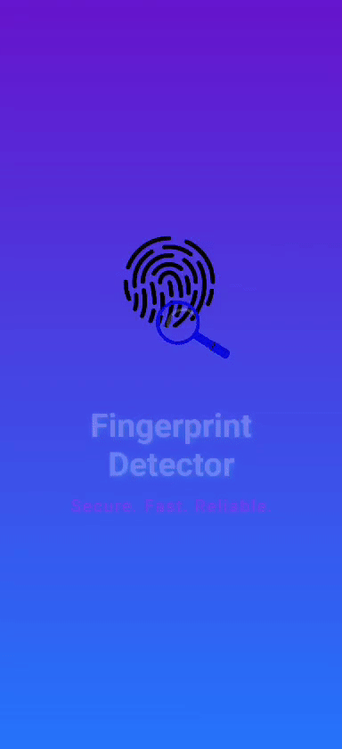

# 🔐 Cyber KnightsBridge – Biometric Matcher Android App

A modern, secure, and visually immersive Android app using **Jetpack Compose**, **Biometric Authentication**, and **Fingerprint Matching**. Designed with elegance and security in mind.

## ✨ Features

- 🚀 **Splash Screen** with gradient animation  
- 🔐 **Biometric Authentication** using Fingerprint  
- 🧠 **Fingerprint Matcher** to match with registered profiles  
- 👤 **User Profile View** with editable info  
- 🖊️ **Profile Edit Screen** with smooth UI transitions  
- 📦 **Jetpack Compose** architecture with Material 3 styling  
- 🌈 **Animated Shimmer Gradient** background on auth screen  
- 📁 **Modular Codebase** for future enhancements

---



## 📸 Screenshots

### 🟣 Splash Screen


### 🔐 Finger Authentication


### 🧠 Finger Matcher


### 👤 Profile View


### ✏️ Profile Edit


### 🔄 Updated Profile


---

## 🧰 Tech Stack

- 💙 **Kotlin** + **Jetpack Compose**
- 📱 **AndroidX Biometric Library**
- 🧠 **Fingerprint Matching Logic (Custom Model or Database Lookup)**
- 🎨 **Material 3** UI Design
- 🗃️ **MVVM Architecture**
- 🪟 **Compose Navigation**

---

## 🔧 Setup Instructions

1. **Clone the repo**:
   ```bash
   git clone https://github.com/Abhi95081/Cyber_Knightsbridge.git
   cd Cyber_Knightsbridge
2. **Open in Android Studio (preferably Hedgehog or above)**

3. **Run on device/emulator with biometric capability**

## 📌 Notes
Ensure your emulator/device has biometric authentication enabled

Fingerprint matching can be extended using external datasets or image recognition APIs.

## 🙌 Credits
Developed by Abhishek Roushan
Designed for Cyber Security and Identity Verification Demo


